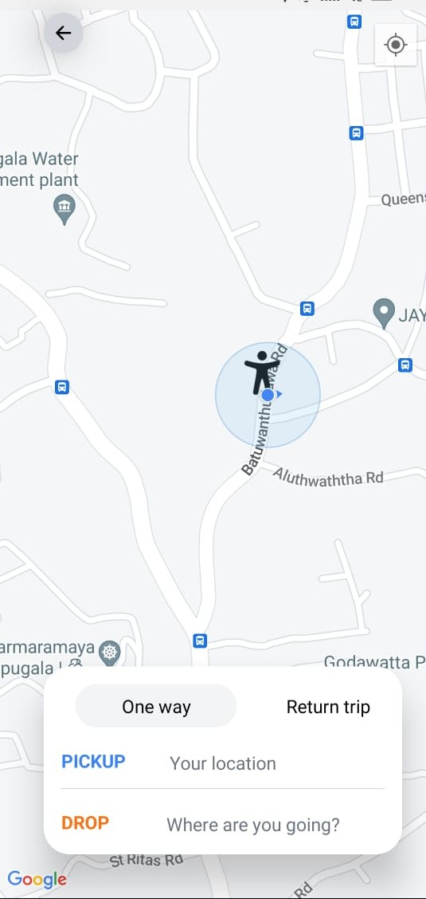

# Welcome to the Pick Me Clone Repository! 📚📱

This mobile clone application to replicate the core features of Pick Me, enabling users to set their pickup location, choose from various ride options, and complete payments seamlessly within the app

## Technology stack
Frontend
✅ React Native | Nativewind
Frontend
✅ Firebase | Google Cloud | Stripe

## Key Features:
- Ride Booking: Set your pickup location and destination with ease.
- Real-time GPS Tracking: Track your ride in real-time from pickup to drop-off.
- Multiple Ride Options: Choose from a variety of ride options, including standard and premium vehicles.
- Seamless Payments: Complete your payment effortlessly within the app using various payment methods.
- Fare Estimation: Get an estimated fare before booking your ride.

Feel free to explore the code, contribute, and share your feedback to help improve the application!

- Loading Page
-  

- Login Page
-  

- Dashboard
-  

- Live Location Page 
-  
-  

- Navigating Page
-  

- Ride Option Page
-  

